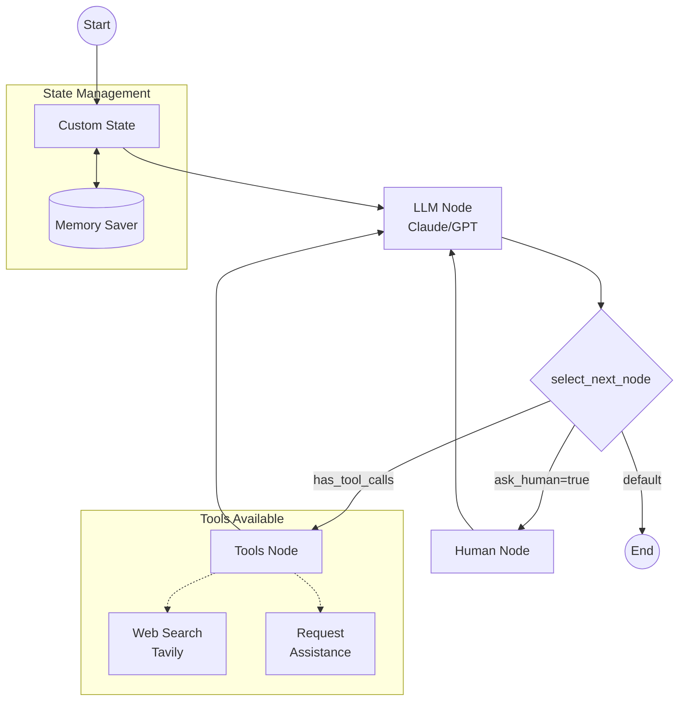

# LangGraph Cloud Chatbot

A chatbot implementation using LangGraph Cloud that combines the power of large language models (Anthropic's Claude or OpenAI's GPT) with web search capabilities and human-in-the-loop functionality.

## Features

- 🤖 Flexible LLM support (Claude or GPT-4)
- 🔍 Integrated web search capabilities via Tavily
- 👥 Human-in-the-loop functionality for complex queries
- 📊 State management and conversation flow control
- 🔄 Checkpoint system for conversation persistence
- 📈 Visualization of the conversation flow graph

## Diagram 


## Prerequisites

```bash
pip install -r "requirements.txt"
```

## Environment Variables

Create a `.env` file with your API keys:

```bash
ANTHROPIC_API_KEY=your_anthropic_key
OPENAI_API_KEY=your_openai_key
TAVILY_API_KEY=your_tavily_key

# Optional: Specify models
ANTHROPIC_MODEL=claude-3-5-sonnet-20240620
OPENAI_MODEL=gpt-4
```

## Architecture

The chatbot is built using a state graph architecture with the following components:

### State Management

```python
class CustomState(TypedDict):
    messages: Annotated[list[str], add_messages]
    ask_human: bool
```

### Core Components

1. **Chatbot Node**: Processes messages using the LLM and determines if human assistance is needed
2. **Human Node**: Handles human intervention in the conversation flow
3. **Tools Node**: Manages external tools like web search
4. **Edge Logic**: Controls conversation flow based on state

### Available Tools

1. **Web Search**: Powered by Tavily for real-time information retrieval
2. **Request Assistance**: Escalation mechanism for complex queries

## Usage

```python
# Initialize the graph
memory = MemorySaver()
graph = builder.compile(checkpointer=memory, interrupt_before=["human"])

# Stream conversation updates
_stream_graph_updates(graph, user_input="Your question here")
```

## Customization

### Changing LLM Provider

To switch between Anthropic and OpenAI:

```python
# For Anthropic Claude
llm = ChatAnthropic(model=ANTHROPIC_MODEL)

# For OpenAI GPT
llm = ChatOpenAI(model=OPENAI_MODEL)
```

### Adding Custom Tools

Create a new tool by defining a Pydantic model:

```python
class CustomTool(BaseModel):
    """
    Tool description here
    """
    param1: str
    param2: int

tools = [web_search, RequestAssistance, CustomTool]
llm_with_tools = llm.bind_tools(tools)
```

## Deployment

1. Clone the repository
2. Install dependencies: `pip install -r requirements.txt`
3. Set up environment variables
4. Run the application: `python main.py`

## Contributing

1. Fork the repository
2. Create a feature branch
3. Commit your changes
4. Push to the branch
5. Create a Pull Request

## License

This project is licensed under the MIT License - see the [LICENSE](LICENSE) file for details.

## Acknowledgments

- LangChain for the core LLM integration
- LangGraph for the conversation flow management
- Tavily for web search capabilities
- Anthropic and OpenAI for LLM services
